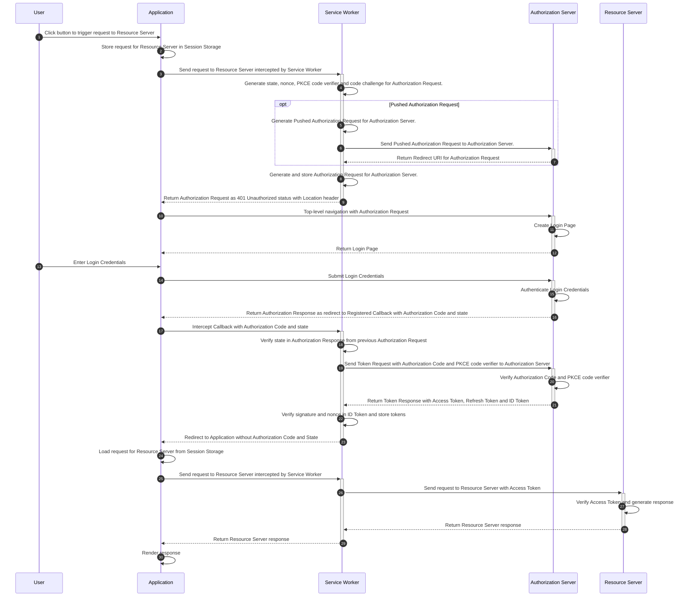

# OAuth2 Client Worker Example

An example React Single Page Application that uses the Service Worker model to acquire OAuth2 tokens.

This example

- Uses Keycloak as the Authorization Server and Resource Server for testing.
- Uses `vite-plugin-pwa` that uses `workbox` to register the Service Worker.

## Background



## Quick Start

### Install

The `oauth2-client-worker` library needs to be built in `dist` first

```shell
cd..
npm run build
```

The packages for the example then need to be installed

```shell
npm install
```

### Development Server

The development server can be run using

```shell
npm run dev
```

The development server will be running on http://localhost:5173/.

### Preview Server (Optional)

The preview server uses the production build to run and best reflects how the Application will run in production

The preview server needs the example to be built first

```shell
npm run build
```

The preview server can be run using

```shell
npm run preview
```

The preview server will be running on http://localhost:5173/.

## Keycloak Server

Keycloak can be downloaded from https://www.keycloak.org/downloads.

```shell
kc start-dev
```

Keycloak will be running at http://localhost:8080

The admin user should be created with `admin` user and `admin` as password

The Public Client `testclient` can be setup using the following script which will set the Web Origins for Cross-Origin Resource Sharing and Registered Redirect URIs for the Application.

```shell
node scripts/keycloak-setup.js
```

## Template

The following are the initial commands for creating the example.

```shell
npm create vite@latest oauth2-client-worker-example -- --template react-ts
```

```shell
npm install -D vite-plugin-pwa
```
